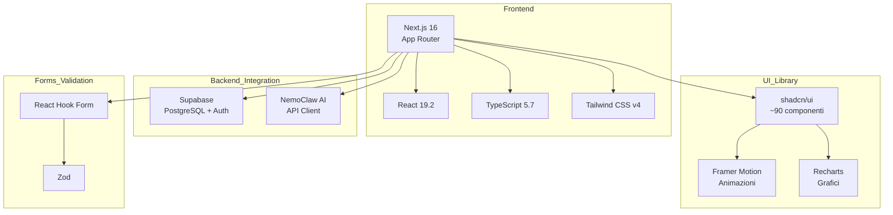
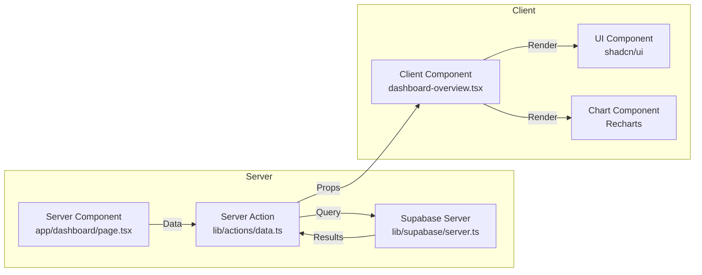
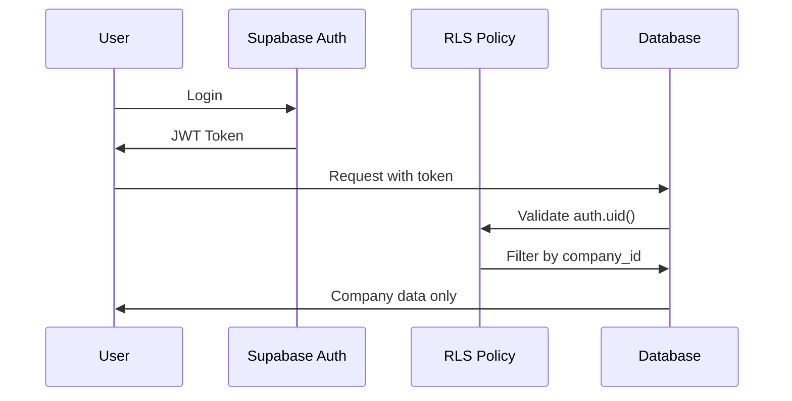
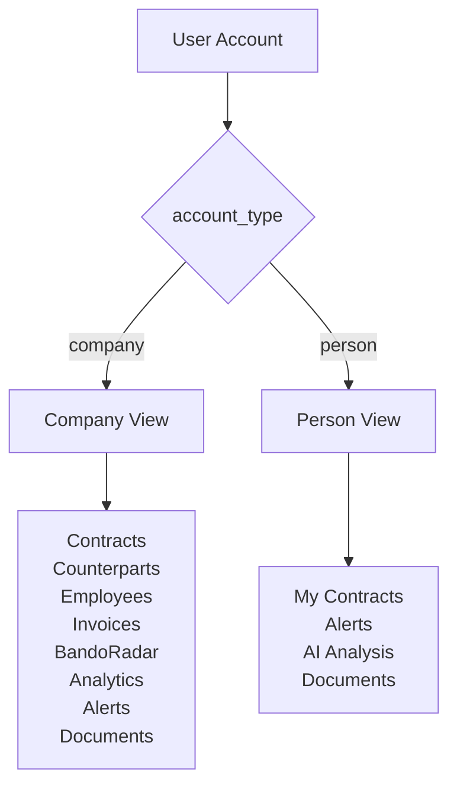
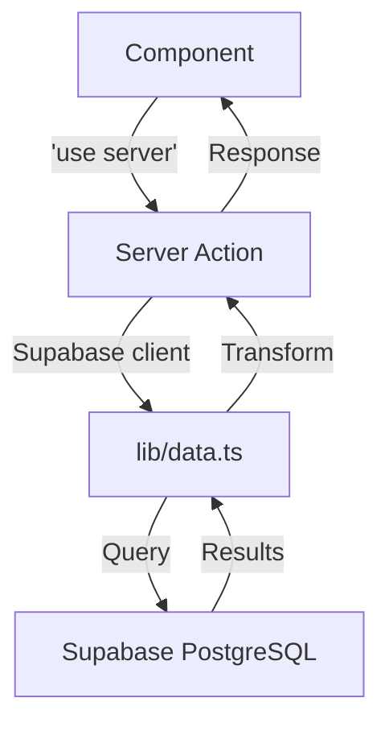
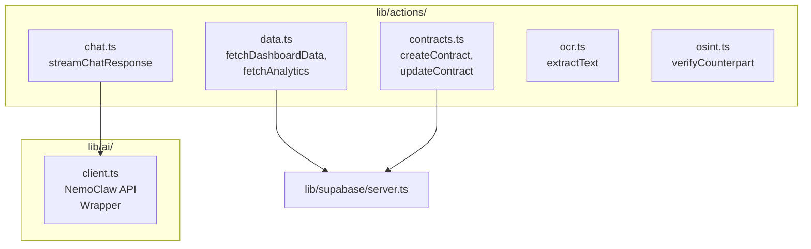
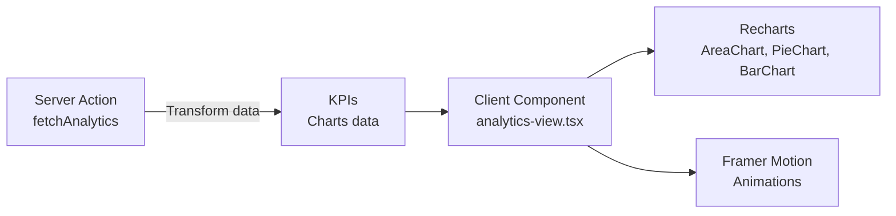

# Terminia - Frontend Architecture

> **Terminia** è una piattaforma B2B SaaS per PMI italiane per gestire contratti, fatture, controparti, dipendenti e bandi pubblici.

## 📋 Sommario

- [Stack Tecnologico](#stack-tecnologico)
- [Struttura del Progetto](#struttura-del-progetto)
- [Architettura](#architettura)
- [Data Flow](#data-flow)
- [Convenzioni](#convenzioni)

---

## 🛠 Stack Tecnologico



| Categoria | Tecnologia | Versione |
|-----------|------------|----------|
| **Framework** | Next.js | 16.2.0 |
| **UI Library** | React | 19.2.4 |
| **Linguaggio** | TypeScript | 5.7.3 |
| **Styling** | Tailwind CSS | 4.2.0 |
| **Componenti** | shadcn/ui (Radix UI) | - |
| **Animazioni** | Framer Motion | 12.38.0 |
| **Grafici** | Recharts | 2.15.0 |
| **Forms** | React Hook Form + Zod | 7.54.1 + 3.24.1 |
| **Database** | Supabase | 2.100.1 |
| **Icons** | Lucide React | 0.564.0 |
| **Package Manager** | pnpm | 9.0.0 |

---

## 📁 Struttura del Progetto

```mermaid
graph TD
    ROOT[Root Directory]

    ROOT --> APP["app/"]
    ROOT --> COMP["components/"]
    ROOT --> LIB["lib/"]
    ROOT --> TYPES["types/"]
    ROOT --> PUBLIC["public/"]
    ROOT --> SUPABASE["supabase/"]

    APP --> AUTH["auth/<br/>Login, Register"]
    APP --> DASH["dashboard/<br/>App protetta"]
    APP --> LANDING["page.tsx<br/>Landing page"]
    APP --> DOCS["docs/<br/>Documentazione"]
    APP --> ONB["onboarding/<br/>Setup azienda"]

    DASH --> CONTRACTS["contracts/<br/>Gestione contratti"]
    DASH --> INVOICES["invoices/<br/>Gestione fatture"]
    DASH --> COUNTERPARTS["counterparts/<br/>Controparti"]
    DASH --> EMPLOYEES["employees/<br/>Dipendenti"]
    DASH --> BANDI["bandi/<br/>BandoRadar"]
    DASH --> ANALYTICS["analytics/<br/>Analisi"]
    DASH --> ALERTS["alerts/<br/>Alerts"]
    DASH --> DOCS_DASH["documents/<br/>Documenti"]
    DASH --> AI["ai-analysis/<br/>AI Chat"]

    COMP --> UI["ui/<br/>~90 shadcn/ui"]
    COMP --> DASH_COMP["dashboard/<br/>Componenti dashboard"]
    COMP --> LANDING_COMP["landing/<br/>Sezioni landing"]

    UI --> CHART["chart.tsx<br/>Recharts wrapper"]
    UI --> ANIM["container-scroll,<br/>scroll-reveal,<br/>timeline-scroll"]

    DASH_COMP --> CONV["dashboard-overview,<br/>analytics-view"]
    DASH_COMP --> LISTS["*-list.tsx<br/>Liste dati"]
    DASH_COMP --> FORMS["*-new-form.tsx<br/>Form creazione"]
    DASH_COMP --> DETAIL["*-detail.tsx<br/>Dettagli"]
    DASH_COMP --> AI_CHAT["ai-chat-sidebar<br/>Chat AI"]

    LIB --> ACTIONS["actions/<br/>Server Actions"]
    LIB --> SUPABASE_LIB["supabase/<br/>Client Supabase"]
    LIB --> AI_LIB["ai/<br/>NemoClaw client"]
    LIB --> HOOKS["hooks/<br/>Custom hooks"]
    LIB --> DATA["data.ts<br/>Data layer"]
    LIB --> MOCK["mock-data.ts<br/>Types & utility"]

    ACTIONS --> CHAT_ACT["chat.ts"]
    ACTIONS --> CONT_ACT["contracts.ts"]
    ACTIONS --> DATA_ACT["data.ts<br/>Fetch dati"]
    ACTIONS --> OCR_ACT["ocr.ts"]
    ACTIONS --> OSINT_ACT["osint.ts"]

    TYPES --> DB["database.ts<br/>Tipi Supabase"]
    TYPES --> MODELS["models.ts<br/>Models"]
    TYPES --> TERM["terminia.ts<br/>Types Terminia"]

    SUPABASE --> MIGRATIONS["migrations/<br/>SQL migrations"]
```



### Dettaglio Directory

```
cia/
├── app/                          # Next.js App Router
│   ├── auth/                     # Autenticazione
│   │   ├── login/               # Pagina login
│   │   ├── register/            # Pagina registrazione
│   │   └── actions.ts           # Server Actions auth
│   ├── dashboard/                # Dashboard protetta
│   │   ├── contracts/           # Contratti
│   │   ├── invoices/            # Fatture
│   │   ├── counterparts/        # Controparti
│   │   ├── employees/           # Dipendenti
│   │   ├── bandi/               # BandoRadar
│   │   ├── analytics/           # Analytics
│   │   ├── alerts/              # Alerts
│   │   ├── documents/           # Documenti
│   │   ├── ai-analysis/         # AI Chat
│   │   ├── layout.tsx           # Layout dashboard
│   │   └── page.tsx             # Home dashboard
│   ├── onboarding/              # Onboarding post-signup
│   ├── docs/                    # Documentazione pubblica
│   ├── layout.tsx               # Root layout
│   ├── page.tsx                 # Landing page
│   └── globals.css              # Stili globali
│
├── components/
│   ├── ui/                      # shadcn/ui (~90 componenti)
│   │   ├── chart.tsx           # Wrapper Recharts
│   │   ├── form.tsx            # Form components
│   │   ├── button.tsx          # Button
│   │   ├── dialog.tsx          # Dialog
│   │   └── ...                 # Altri componenti UI
│   ├── dashboard/               # Componenti dashboard
│   │   ├── sidebar.tsx         # Sidebar navigazione
│   │   ├── header.tsx          # Header dashboard
│   │   ├── dashboard-overview.tsx
│   │   ├── analytics-view.tsx
│   │   ├── contracts-list.tsx
│   │   ├── contract-detail.tsx
│   │   ├── contract-new-form.tsx
│   │   ├── ai-chat-sidebar.tsx # Chat AI integrata
│   │   └── ...                 # Altri componenti dashboard
│   └── landing/                 # Sezioni landing page
│       ├── hero.tsx
│       ├── features.tsx
│       └── ...                 # Altre sezioni
│
├── lib/
│   ├── actions/                 # Server Actions
│   │   ├── chat.ts             # Chat AI
│   │   ├── contracts.ts        # Operazioni contratti
│   │   ├── data.ts             # Data fetching
│   │   ├── ocr.ts              # OCR
│   │   └── osint.ts            # OSINT
│   ├── supabase/               # Client Supabase
│   │   ├── client.ts           # Browser client
│   │   └── server.ts           # Server client
│   ├── ai/                     # NemoClaw AI client
│   │   └── client.ts           # API client
│   ├── hooks/                  # Custom React hooks
│   ├── data.ts                 # Data layer (Supabase queries)
│   ├── mock-data.ts            # Types, enums, utility
│   └── utils.ts                # Utility functions
│
├── types/
│   ├── database.ts             # Auto-generati da Supabase
│   ├── models.ts               # Models
│   └── terminia.ts             # Types custom Terminia
│
├── supabase/
│   └── migrations/             # SQL migrations
│
├── public/                     # Asset statici
│   ├── images/
│   └── loghi_api/
│
├── next.config.mjs             # Configurazione Next.js
├── tailwind.config.ts          # Configurazione Tailwind
├── tsconfig.json               # Configurazione TypeScript
├── package.json                # Dipendenze
└── CLAUDE.md                   # Guide per Claude Code
```

---

## 🏗 Architettura

### Pattern Server/Client Components



**Regola:**
- **Server Components**: Data fetching, Server Actions, layout
- **Client Components**: Interattività, stato, animazioni

### Autenticazione e Multi-Tenancy



**Isolamento dati:**
- Ogni utente ha un `company_id`
- Row Level Security (RLS) su tutte le tabelle
- Funzione `auth_company_id()` per isolamento multi-tenant

### Tipi di Account



---

## 🔄 Data Flow

### Flusso Dati Standard



### Server Actions Layer



**File chiave:**
- `lib/actions/data.ts` - Data fetching dashboard/analytics
- `lib/actions/contracts.ts` - CRUD contratti + AI
- `lib/actions/chat.ts` - Chat streaming
- `lib/data.ts` - Tutte le query Supabase (centralizzate!)

---

## 📐 Convenzioni

### Styling

```typescript
// ✅ CORRETTO - Usa cn() per className composition
import { cn } from "@/lib/utils"
<div className={cn("base-class", condition && "conditional-class")} />

// ❌ SBAGLIATO - Non concatenare stringhe
<div className={"base-class " + (condition && "conditional-class")} />
```

**Colori:** OKLCH in `app/globals.css`
- Light theme: teal/cyan
- Dark theme: navy/deep teal

### Componenti shadcn/ui

```bash
# Per aggiungere un nuovo componente UI
pnpm dlx shadcn@latest add <component-name>
```

⚠️ **NON modificare mai manualmente i file in `components/ui/`**

### Form

```typescript
// React Hook Form + Zod pattern
import { useForm } from "react-hook-form"
import { zodResolver } from "@hookform/resolvers/zod"
import { z } from "zod"

const schema = z.object({
  name: z.string().min(1),
  email: z.string().email(),
})

const form = useForm({
  resolver: zodResolver(schema),
  defaultValues: { name: "", email: "" },
})
```

### Icons

```typescript
// ✅ CORRETTO - Import by name
import { FileText, User, Settings } from "lucide-react"

// ❌ SBAGLIATO
import * as Icons from "lucide-react"
```

### Type Definitions

```typescript
// lib/mock-data.ts - Types condivisi
export type ContractStatus = "draft" | "negotiating" | "active" | "expiring"
export type InvoiceStatus = "pending" | "paid" | "overdue"

// types/database.ts - Auto-generati da Supabase
import type { Tables, TablesInsert } from "@/types/database"
```

### Supabase Client

```typescript
// Server Components e Server Actions
import { createClient } from "@/lib/supabase/server"
const supabase = await createClient()

// Client Components
import { createClient } from "@/lib/supabase/client"
const supabase = createClient()
```

### Variabili Environment

```bash
# .env.local (non committare in git!)
NEXT_PUBLIC_SUPABASE_URL=
NEXT_PUBLIC_SUPABASE_ANON_KEY=
NEMOCLAW_API_URL=          # Optional, default: https://nemoclaw.pezserv.org
```

⚠️ **Non usare MAI service-role keys in `NEXT_PUBLIC_` variables**

---

## 📊 Visualizzazioni Dati (Analytics)



**Tipi di grafici implementati:**
- `AreaChart` - Andamento valore portfolio
- `PieChart` - Distribuzione contratti per tipologia
- `BarChart` - Trend rischio contrattuale
- `LineChart` - Previsione rinnovi

---

## 🚀 Quick Start

```bash
# Installa dipendenze
pnpm install

# Avvia dev server
pnpm dev
# → http://localhost:3000

# Build produzione
pnpm build

# Lint
pnpm lint
```

---

## 📝 File Chiave Riferimento

| File | Scopo |
|------|-------|
| `CLAUDE.md` | Guida completa per sviluppo |
| `lib/mock-data.ts` | Types, enums, formatters |
| `lib/data.ts` | Data layer (tutte le query Supabase) |
| `lib/supabase/server.ts` | Server client per Server Actions |
| `lib/supabase/client.ts` | Browser client per Client Components |
| `components/ui/chart.tsx` | Infrastruttura grafici Recharts |
| `app/dashboard/layout.tsx` | Layout protetto dashboard |
| `types/database.ts` | Tipi auto-generati Supabase |

---

## 🔒 Sicurezza

- **RLS (Row Level Security)** su tutte le tabelle
- **Server Actions** per operazioni mutazioni
- **Zod validation** per tutti i form
- **TypeScript strict mode**
- Nessun service-role key nel frontend

---

## 📄 Licenza

Privato - Terminia SaaS
